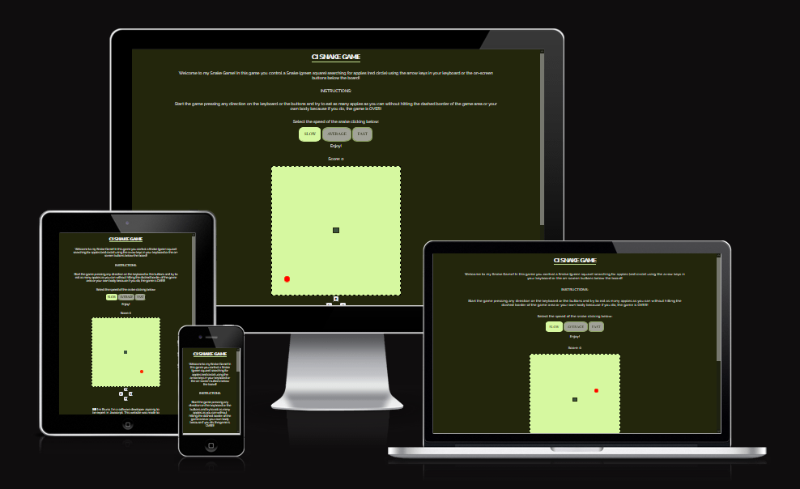
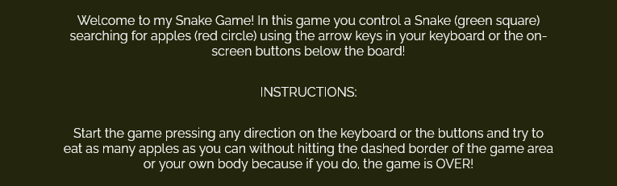
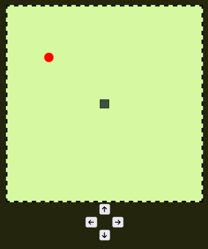

# Snake Game Website

[Access the Live CI Snake Game Website here](https://bruno-diego.github.io/ci-portfolio2/) (Ctrl + Click to open on a new tab)

## Table of Contents
1. [**UX**](#ux)
    - [**Purpose of the project**](#purpose-of-the-project)
    - [**User stories**](#user-stories)
    - [**Features**](#features)
    - [**Future features**](#future-features)

2. [**Typography and color scheme**](#typography-and-color-scheme)

3. [**Wireframes**](#wireframes)

4. [**Technologies Used**](#technologies-used)
    - [**Code validation**](#code-validation)
    - [**Test cases (user story based with screenshots)**](#test-cases)
    - [**Fixed bugs**](#fixed-bugs)
    - [**Supported screens and browsers**](#supported-screens-and-browsers)

5. [**Deployment**](#deployment)
    - [**Via Gitpod**](#via-gitpod)
    - [**Via Github Pages**](#via-github-pages)
6. [**Credits**](#credits)

---

## UX

## Purpose of the project

Welcome fellow visitor,

This is the CI Snake Game Website. Our goal is to give the user a game that can be both challenging and fun!

This website is made of the following sections:

  1. Title.
  2. Instructions to play the game.
  3. Gaming area.
  4. On-screen controls.
  5. Feedback area.
  6. Social media links.

The business goals for this website are:

  1. To give the user a fun and challenging game.
  2. To get user feedback about the game.

The target users are:

  - People of all ages.
  - Interested in playing a game that is challenging and fun at the same time.

What these users would be looking for:

  - A game that can be played to pass time without being too stressful.
  - A game with multiple levels of difficulty to be challenging.
  - A game that can be played using the keyboard or the on-screen commands.
  - A funny game to play with the option to provide feedback.

The user interested in play this game can see from the title that it's a snake game. Immediately the user can find the instructions to play the game when the page is loaded. The user is presented with the options to change the speed of the game between Low, Average and Fast. The Standard option is Slow but it can be changed at any momment before the game starts or during the gameplay. The user can choose to use his own keyboard or the on-screen buttons to move the snake on the gaming area. Below the controls buttons, the user can see a presentation paragraph and a form to send feedback to the website's creator. At the bottom of the page, the user can access the links for social media.

The following features will be included in this release:

  - Title with a link to the main page.
  - Instructions for the user about how to play the game.
  - Options to change the speed of the game.
  - Gaming area.
  - E-mail contact form.
  - Links to social media pages.

This website was crafted using semantic HTML5 for structure, CSS3 for stylings and presentation and Javascript for dynamic and interactive content. It was created to give birth to the Second "Portfolio Project" to complete as part of the Diploma in Full Stack Software Development course at Code Institute in Dublin, Republic of Ireland. 

For better UI/UX, a modern and simple interface is used with a well-defined title, spaced letters with good contrast for a cool reading and colors based on a forrest pallette uniformized in the entire website.

The layout has an intuitive structure with the title at the top, the footer at the bottom and the content in the area in between. The styling is consistent through all pages. Links to the social media are styled to have an animated fade when when hovered upon and also open in a new tab.

The footer contains icons for Facebook, Instagram, Github and LinkedIn, which link as expected to the website's and the creator's accounts on the respective platforms. The website is fully responsive and can be accessed on many different screens and is compatible with the most used browsers.

## User stories

- As a **visitor**, I can intuitively navigate through the site so that I can view desired content.
- As a **visitor**, I can easily find the title of the game and know what the game is about.
- As a **visitor** I can find a navigation bar at the top and a footer at the bottom so that I can see what content there is on the website.
- As a **visitor** I can find links at the footer that open to social media websites on a new tab.
- As a **visitor** I can get key information about the website so that I can spend less time having to search for information including the instructions to play the game.
- As a **visitor** I can easily change the speed of the game choosing between Slow, Average and Fast speed.
- As a **visitor** I can immediately find the gaming area to play.
- As a **visitor** I can choose to use the keyboard to play the game or to use the on-screen buttons.
- As a **visitor** I can contact the creator via e-mail with the contact form.
- As a **visitor** I am notified about the success/fail submission of the e-mail message.
- As a **visitor** I can access the website on both mobile and desktop so that I can view the information regardless of my location.

## Features

### Title

  - The title is clear and elusive to the game itself, made to be reckognized by the user as a snake game. It has a link that leads back to the main page at any momment.

### Instructions

  - The instructions area helps the user to understand how the came can be played and what are the rules in a clear and precise way to avoid any sort of confusion. 

### Game Difficuty

  - The game has three levels of difficulty: Slow, Average and Fast. The default level is slow and the user can change this difficulty before or after start to play the game.

### Gaming Area

  - The gaming area includes a Score field that is increased by 1 everytime the user use the snake on the screen to eat one piece of fruit in the game.
  - The gaming area is composed of a square made on a grid style with 21 rows and 21 colums.
  - The gaming area also includes on-screen buttons that the user can use to move the snake on the board with arrows indicating each direction. 

### Feedback Form

  - The feedback form area contains a brief text with information about the website and it's creator, and asks to the user for a feedback.
  - The feedback form itself it's composed by three fields: Name, E-mail and Message. All the fields are required and after clicking the submit button, the user is redirected to the success page.

### Footer
  
  - The footer section includes links to the relevant social media sites for Love Running. The links will open to a new tab to allow easy navigation for the user. 
  - The footer is valuable to the user as it encourages them to keep connected via social media.

### The Success Page

  - The button on the contact form leads the user to the success page confirming that the e-mail with the message was successfully sent. 

### Future features

 - For the future deployments to the website, I would like to implement a newsletter for user subscription;
  - Besides, I would like to implement on the future multiple pages with different types of games;
  - I also would like to create a section for users' comments.

## Typography and color scheme

- The main font used on the website was `Raleway` from [Google Fonts](https://fonts.google.com/). is an elegant sans-serif typeface family. [Source](https://fonts.google.com/specimen/Raleway?query=Raleway#about).

- The colors on the website are inspired by a Forrest/Bamboo Palette created on [Coolors.co](https://coolors.co/) with multiple shades of greens to inspire a natural vibe in the user.

## Wireframes

This website was first planned from scratch on Balsamic Wireframes with the license provided by the Code Institute. [Click here](./assets/docs/snake-game-wireframes.pdf) to see the wireframes of the raw project.

Please note the actual website has changed slightly from these wireframes.

## Technologies Used

I have used several technologies that have enabled this design to work:

  - [HTML](https://developer.mozilla.org/en-US/docs/Web/HTML)
    - Used as the basic building block for the project and to structure the content.
  - [CSS](https://developer.mozilla.org/en-US/docs/Learn/Getting_started_with_the_web/CSS_basics)
    - Used to style all the web content across the project. 
  - [Font Awesome](https://fontawesome.com/)
    - Used to obtain the social media icons used in the footer and the icons in La Petite Review.
  - [Google Developer Tools](https://developers.google.com/web/tools/chrome-devtools)
    - Used as a primary method of fixing spacing issues, finding bugs, and testing responsiveness across the project.
  - [GitHub](https://github.com/)
    - Used to store code for the project after being pushed.
  - [Git](https://git-scm.com/)
    - Used for version control by utilising the Gitpod terminal to commit to Git and Push to GitHub.
  - [Gitpod](https://www.gitpod.io/)
    - Used as the development environment.
  - [Balsamiq](https://balsamiq.com/)
    - Used to create the wireframes for the project
  - [Coloors](https://coolors.co/)
    - Used to create a color palette for the design.
  - [Favicon.io](https://favicon.io/)
    - Used to create favicon for my website.
  - [Color Contrast Accessibility Validator](https://color.a11y.com/)
    - Allowed me to test the color contrast of my webpage.
  - [W3C Markup Validation Service](https://validator.w3.org/) 
    - Used to validate all HTML code written and used in this webpage.
  - [W3C CSS Validation Service](https://jigsaw.w3.org/css-validator/#validate_by_input)
    - Used to validate all CSS code written and used in this webpage.
  - [FormSubmit](https://formsubmit.co/)
    - Used to submit a contact message with the HTML form.
  - [AmIResponsive](http://ami.responsivedesign.is/)
    - Used to generate repsonsive image used in README file.
  - [GIMP](https://www.gimp.org/)
    - Used to edit the success page image.
  - [CodePen.io](https://codepen.io/)
    - Used to research code.
  - [Grammarly](https://www.grammarly.com/)
    - Used to fix the grammar errors across the project.

## Code validation 

- HTML
  - No errors were returned when passing through the official [W3C validator](https://validator.w3.org/nu/?doc=https%3A%2F%2Fbruno-diego.github.io%2Fci-portfolio2%2F).

- CSS
  - No errors were found on the website when passing through the official [(Jigsaw) validator](https://jigsaw.w3.org/css-validator/validator?uri=https%3A%2F%2Fbruno-diego.github.io%2Fci-portfolio2%2F&profile=css3svg&usermedium=all&warning=1&vextwarning=&lang=en).

- JSHint
  - 

- [Lighthouse](https://developers.google.com/web/tools/lighthouse)
  - Lighthouse is a feature of Google Chrome developer tools and is used to assess the performance of the website and its features. I achieved a  good performance, assessibility, best practises and SEO scores, as you can see on this [report](./assets/docs/lighthouse.pdf).

- [Color Contrast Accessibility Validator](https://color.a11y.com/)
  - Allowed me to test the colour contrast of my webpage.
  

## Test cases

1. **As a visitor, I can intuitively navigate through the site so that I can view desired content.**
    - As soon as you enter the page you can easily see the title, which is elusive to the game and is a link to refresh the page.
    - The title of the main page is indicated by the bottom border beneath it.
    - The user can click the website's title "CI SNAKE GAME' to refresh the page.
      

2. **As a visitor, I can easily find information about the website and how to explore it.**
    - You can immediately find on the first block of text, information about what is the game to be played, how the user should interact andwhats the main goal.
    - Below the first paragraph, you will find the instructions of how to play the game.
          

3. **As a visitor, I can change the difficulty of the game.**
    - Immediately below the instructions, You can find three buttons: Slow, Average and Fast. The buttons that are not selected have opacity of 0.6 and the background white, while the selected has opacity 1 and the background green.
    - The default option is SLOW and is indicated by the button with full opacity and green background. Whith this option selected, the snake moves 5 blocks per second.
    - The user hover the mouse over the option average and the opacity becomes 1 with a quick transition using CSS. 
    - The user clicks the button with the option Average and its backgound becomes green, while the option Slow becomes white with opacity 0.6 and the snake moves 10 blocks per second.
    - The user hover the mouse over the option Fast and the opacity becomes 1 with a quick transition using CSS. 
    - The user clicks the button with the option Fast and its backgound becomes green, while the option Average becomes white with opacity 0.6 and the snake moves 15 blocks per second.
          

4. **As a visitor, I can easily find monitor my progress on the game with the increasing score.**
    - The user can see the Score above the gaming board to monitor his progress.
    - The user press the keyboard or the on-screen arrows to move the snake to any direction and start the game.
    - The snake starts moving and the user move the snake in the direction of the food.
    - The Score is increased by 1 everytime the head of the snake passes over the red food.

5. **As a visitor, I can easily find and interact with the game board.**
    - The user identify the gaming board by the big square in the center of the page.
    - The user identify the snake as a green square in the center of the board as per instructions.
    - The food is created when the page is loaded in a random position inside the board.
    - The user press the keyboard or the on-screen arrows to move the snake to any direction and start the game.
    - The snake starts moving and the user move the snake in the direction of the food.
    - The Score is increased by 1 everytime the head of the snake passes over the red food.

6. **As a visitor, I can provide feedback to the website sending an e-mail to it's creator.**
    - The main page contains a form that you can fill in with your name, e-mail and a message that is sent straight to the e-mail of the website's creator.
    - If the user clicks the `Submit e-mail!` Button an error message will be displayed on the `Name` field as this is a required field;
    - The user fills the `Name` field with his name;
    - If the user clicks the `Submit e-mail!` Button an error message will be displayed on the `E-mail` field as this is a required field;
    - The user fills the `E-mail` field with his contact e-mail;
    - If the user clicks the `Submit e-mail!` Button an error message will be displayed on the `Message` field as this is a required field;
    - The user fills the `Message` field with his message directed to the website's creator;
    - If the user clicks the `Submit e-mail!` Button and no error should appear;
    - The user is redirected to the success page confirming the submission of the form.

  

7. **As a visitor I am notified about the success/fail submission of the e-mail message.**
    - As soon as you submit your message by clicking the `Submit e-mail!` button, you are redirected to a Success Page, confirming that the submission was successful.
    - When the page is loaded the user can immediately see a message of confirmation;

    
  
## Fixed bugs

## Supported Screens and Browsers

- The website is fully responsive and can be accessed on smartphones (width of 600px and smaller), tablets (width of 820px and smaller) and monitors of any size.

- The website was tested and is supported on the browsers Google Chrome, Mozilla Firefox, Microsoft Edge, Opera and Brave.

## Deployment

The master branch of this repository has been used for the deployed version of this application.

## Via Gitpod

The project deployment was based on the [Code Institute Gitpod Full Template](https://github.com/Code-Institute-Org/gitpod-full-template).

  - Click the `Use This Template` button.
  - Add a repository name and brief description.
  - Click the `Create Repository from Template` to create your repository.
  - To create a Gitpod workspace you then need to click `Gitpod`, this can take a few minutes.
  - When you want to work on the project it is best to open the workspace from Gitpod (rather than Github) as this will open your previous workspace rather than create a new one. You should pin the workspace so that it isn't deleted.
  -  Committing your work should be done often and should have clear/explanatory messages, use the following commands to make your commits:
    - `git add .`: adds all modified files to a staging area
    - `git commit -m "A message explaining your commit"`: commits all changes to a local repository.
    - `git push`: pushes all your committed changes to your Github repository.
  - You can view the website in a browser by using the command `python3 -m http.server` and clicking on the button `Open Browser` on the box that will pop up.

*Forking the GitHub Repository*

If you want to make changes to your repository without affecting it, you can make a copy of it by 'Forking' it. This ensures your original repository remains unchanged.

  1. Find the relevant GitHub repository
  2. In the top right corner of the page, click the Fork button (under your account)
  3. Your repository has now been 'Forked' and you have a copy to work on

*Cloning the GitHub Repository*

Cloning your repository will allow you to download a local version of the repository to be worked on. Cloning can also be a great way to backup your work.

  1. Find the relevant GitHub repository
  2. Press the arrow on the Code button
  3. Copy the link that is shown in the drop-down
  4. Now open Gitpod & select the directory location where you would like the clone created
  5. In the terminal type 'git clone' & then paste the link you copied on GitHub
  6. Press enter and your local clone will be created.

## Via Github Pages

  - The live website was deployed to GitHub pages. The steps to deploy are as follows: 
  
    1. Log in to GitHub
    2. In your Repository section, select the project repository that you want to deploy
    3. In the menu located at the top of this section, click `Settings`
    4. Select `Pages` on the left-hand menu - this is around halfway down
    5. In the source section, select branch `Master` and save
    6. The page is then given a site URL which you will see above the source section.

Please note it can take a while for this link to become fully active. 

The live link can be found [here](https://bruno-diego.github.io/ci-portfolio2/).

## Credits 

- Throughout the process of building this website, I have used various sources online to help me fix bugs & tackle problems, in addition to various modules to build the functionality of this website:
  - The text for the Home page and contact page was created by myself.
  - The icons in the footer were taken from [Font Awesome](https://fontawesome.com/).
  - [FormSubmit](https://formsubmit.co/).
  - The Javascript code was inspired by the tutorial found on the [Web Dev Simplified] Youtube Channel and the Github repository can be found [here](https://github.com/WebDevSimplified/Javascript-Snake-Game/).

---

## Acknowledgements

I would like to thank my course mentor Rohit Sharma for his support and guidance throughout the project and our Code Institute Cohort Facilitator Kasia Bogucka for their support & feedback.

---

